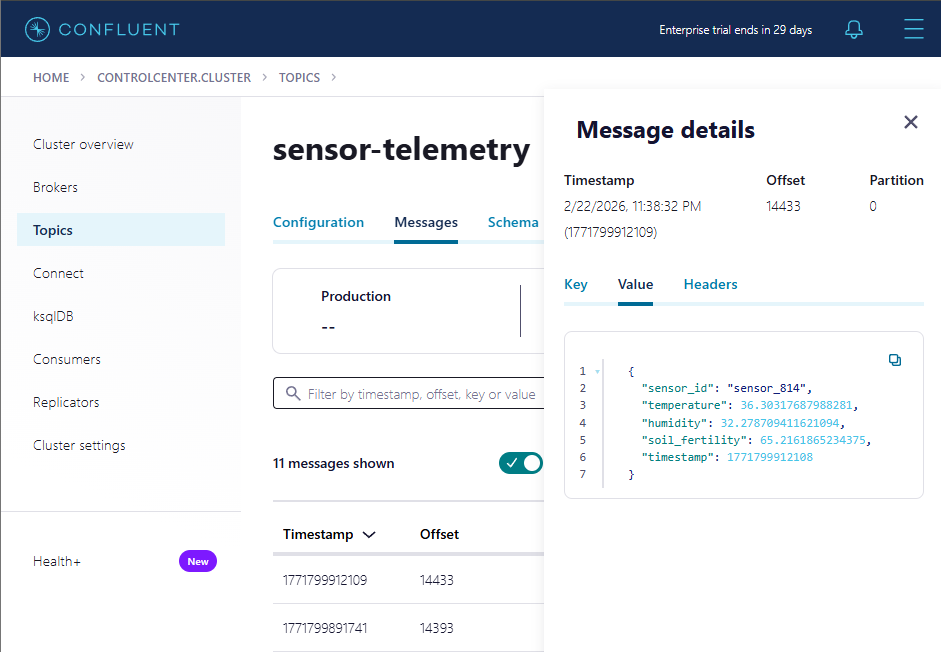
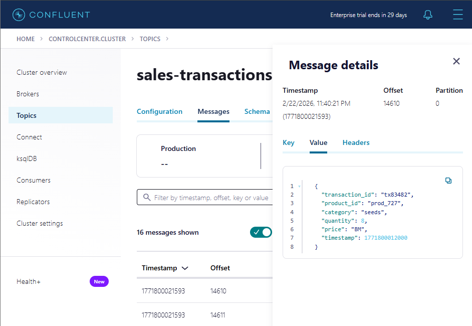
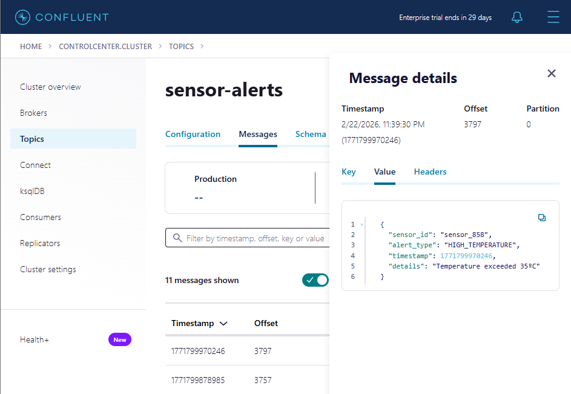
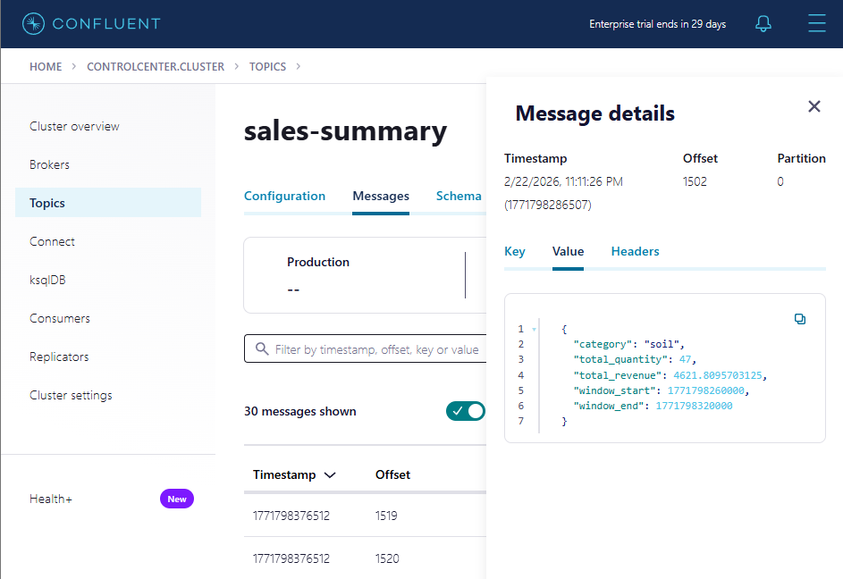
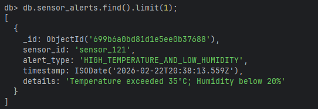

# Tarea

Autor: Eduardo López Delmás

## Organización

La carpeta se organiza en los siguientes directorios:

- **connectors**: contiene los ficheros de configuración de los conectores a desarrollar (*.json)

- **src**: contiene el código fuente del proyecto
  - **main/avro**: contiene los esquemas empleados para producir y consumir en los topics Kafka (*.avsc)
  - **main/java**: contiene las aplicaciones de procesamiento streaming (Kafka Streams), así como las clases Java generadas a partir de los esquemas Avro (*.java)
  - **main/resources**: contiene ficheros de configuración

- **sql**: contiene el DDL de la tabla transactions

## Setup

El siguiente script automatiza algunos de los pasos necesarios para preparar el entorno
para desarrollar la tarea.

1. Inicia el entorno.
2. Crea la tabla transactions.
3. Instala los plugins de los conectores.
4. Copia los drivers JDBC para MySQL.
5. Copia los schemas AVRO dentro del contenedor de connect.

### Modificaciones realizadas:
- Se ha añadido la descarga del plugin 'jcustenborder/kafka-connect-transform-common', que contiene una amplia variedad de SMTs. Este plugin se ha empleado para añadir el campo 'timestamp' a los registros del conector Datagen de sensor-telemetry mediante una SMT que inserta un campo con el timestamp actual UTC.

```shell
docker compose exec connect confluent-hub install --no-prompt jcustenborder/kafka-connect-transform-common:latest
```

- Se han modificado las rutas de los esquemas Avro para apuntar a su nueva ubicación [./src/main/avro].

Uso:
```shell
./setup.sh
```

## Kafka Connect

Con el fin de simular un escenario real y crear interactividad en la tabla de transacciones se proporcionan un par de conectores para cargar la tabla transactions de forma continua.


Los conectores proporcionados (en azul) hacen uso del topic **_transactions** para cargar la tabla **sales_transactions** en la bd MySQL

- source-datagen-_transactions: Genera transacciones que cumplen el schema requerido

- sink-mysql-_transactions: Escribe las transacciones en la tabla de base de datos 

### Conectores implementados

Se han implementado los siguientes conectores (en rojo):

#### Datagen Connector sensor-telemetry:
Conector de tipo Datagen empleado para generar registros que simulan lecturas de sensores de telemetría desplegados en los campos agrícolas de FarmIA. Se apoya en el esquema Avro `sensor-telemetry.avsc` para generar las lecturas y volcarlas en el topic sensor-telemetry.

Cuenta con el campo `sensor_id` de tipo string y los campos numéricos `temperature`, `humidity` y `soil_fertility`, generados usando patrones regex y rangos de valores respectivamente. Además, cuenta con el campo `timestamp`, el cual se genera aplicando una SMT que captura el momento de creación del registro, simulando el timestamp de lectura del sensor.

#### Source Connector sales-transactions:
Conector de tipo JDBC Source encargado de extraer las transacciones de ventas de la tabla `sales_transactions` ubicada en una BD MySQL. Se ha configurado el modo incremental en base al campo `timestamp` para asegurar que cada registro se procesa exactamente una vez.

En este conector fue necesaria la configuración de las siguientes SMTs:
- En primer lugar, se emplea la transformación `RegexRouter` para lograr que el conector escriba en el topic sales-transactions, puesto que, por defecto, crea un topic con el mismo nombre de la tabla que consume (sales_transactions).
- En segundo lugar, se aplica la transformación `ValueToKey` con el fin de establecer el valor del campo `transaction_id` como clave del registro Kafka. Se consideró la utilización del campo `category` como clave para facilitar la agregación posterior, sin embargo, se optó por esta configuración para representar un escenario más realista, puesto que la clave `category` estaría orientada únicamente a la aplicación de consumo SalesSummaryApp.
- En tercer lugar, la SMT `ExtractField$Key` permite la conversión de la clave de formato struct a string.

#### Sink Connector sensor-alerts:
Conector de tipo MongoDB Sink configurado para consumir las alertas de sensores de telemetría publicadas en el topic `sensor-alerts` y volcarlas en una base de datos MongoDB. La escritura se lleva a cabo con writemodel `InsertOneDefaultStrategy`, análogo al clásico modo de append, puesto que no se realizan actualizaciones de alertas pasadas.

El conector se ha configurado activando la tolerancia a errores, es decir, ignorando registros que causen errores en la escritura en lugar de matar el proceso. El motivo es que en un escenario de alertas de sensores de telemetría a menudo se valora más la continuidad de las alertas frente a la consistencia histórica.

Se proporciona un script para automatizar la ejecución de todos los conectores:

```shell
./start_connectors.sh
```

## Kafka Streams

### Esquemas Avro
Para facilitar la interacción de las aplicaciones de Kafka Streams con los topics de Kafka se ha generado una clase Java por cada esquema Avro empleado en el proyecto. Para ello, se ha utilizado el plugin `schema` de avro, el cual se ha incorporado en la definición del fichero `pom.xml` del proyecto. Una vez configurado el plugin, se debe compilar el proyecto con `mvn clean compile` para generar las clases. A continuación, se muestran las clases creadas, localizadas en el directorio `src/main/java`:
- SensorTelemetry (sensor-telemetry.avsc)
- SensorAlert (sensor-alert.avsc)
- SalesTransaction (transactions.avsc)
- SalesSummary (sales-summary.avsc)

### SensorAlerterApp
Esta aplicación de Kafka Streams se encarga de generar alertas para aquellas lecturas de los sensores de telemetría que sobrepasen un umbral predefinido de temperatura o humedad. El flujo de procesamiento consiste en los siguientes pasos:
1. Se consumen las lecturas de los sensores desde el topic `sensor-telemetry` empleando un `SpecificAvroSerde` configurado con el esquema recogido en la clase Java `SensorTelemetry` para asegurar la consistencia de los datos.
2. Se filtran los registros para conservar únicamente los que presenten una temperatura superior a 35ºC o una humedad inferior al 20%.
3. Se genera la alerta correspondiente de entre 3 posibles: temperatura alta, humedad baja o temperatura alta + humedad baja.
4. Se construye un objeto `SensorAlert`, que es enviado posteriormente al topic `sensor-alerts`.

### SalesSummaryApp
Esta aplicación de Kafka Streams agrega los datos de ventas de FarmIA por categoría de producto, calculando el total de ingresos en intervalos de 1 minuto. A continuación, se detalla el flujo de procesamiento:
1. Se consumen los mensajes del topic `sales-transactions`, deserializando mediante un `GenericAvroSerde` para favorecer la simplicidad del proyecto, puesto que el esquema con el que produce el conector JDBC es autogestionado y no se corresponde con la clase `SalesTransactions`.
2. Se selecciona el campo `category` como clave de los registros, para posteriormente agrupar por ella, estableciendo una ventana sin periodo de gracia de 1 minuto de duración.
3. Se aplica un proceso de casteo a float del campo `price`, el cual viene del topic Kafka como bytes con tipo lógico decimal.
4. Se realiza una suma progresiva durante la ventana establecida de la cantidad e ingresos totales registrados por cada categoría.
5. Se crea un objeto `SalesSummary` que contiene la categoría, la cantidad y ganancias totales, así como los timestamps correspondientes al inicio y final de la ventana temporal de agregación.
6. Se escriben los objetos construidos en el topic `sales-summary`.

## Shutdown

El siguiente script permite detener completamente el entorno:

```shell
./shutdown.sh
```

## Prueba de funcionamiento
Para verificar el correcto funcionamiento de todos los componentes desarrollados se puede seguir el siguiente proceso:

### Iniciar el entorno y activar los conectores
```shell
./setup.sh
./start_connectors.sh
```

### Verificar el funcionamiento de los conectores productores en Control-Center

#### Datagen sensor-telemetry

#### JDBC Source sales-transactions


### Arrancar las aplicaciones KafkaStreams y verificar su funcionamiento en Control-Center

#### SensorAlerterApp

#### SalesSummaryApp


### Verificar el funcionamiento del conector MongoDB Sink
Conexión con la base de datos:
```shell
docker exec -it mongodb mongosh -u admin -p secret123 --authenticationDatabase admin
```

Exploración de la base de datos:
```shell
use db;
show collections;
db.sensor_alerts.countDocuments();
db.sensor_alerts.find()
```
Ejemplo de documento de alerta de sensor almacenado en MongoDB:



### Detener el entorno
```shell
./shutdown.sh
```