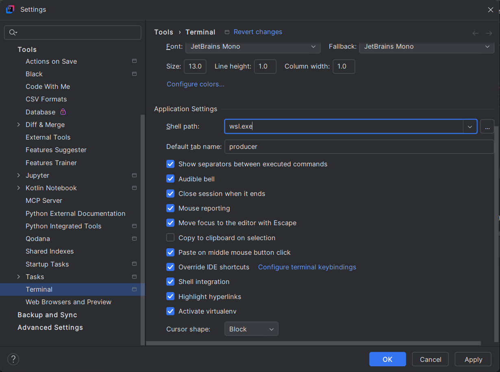

# Kafka y Procesamiento en Tiempo Real

## Prerrequisitos

* [Docker Instalado](https://docs.docker.com/get-docker/)
* JDK 11+ Instalado
* Maven Instalado

## Organización

El repositorio está organizado en carpetas numeradas, en base al orden que seguiremos durante el curso.

Cada una de las carpetas contiene un fichero **README.md** con los pasos y comandos

El proyecto contiene mayoritariamente código en varios lenguajes como java o python

## CLI

Este curso requiere la ejecución de distintas herramientas a través de una línea de comandos

Os recomiendo usar una shell de entorno Linux (Unix, MAC)

Si sois usuarios de **Microsoft Windows** por favor aseguraos de instalar [WSL](https://learn.microsoft.com/es-es/windows/wsl/install)

## IDE

Adicionalmente, los usuarios de **Microsoft Windows** deben configurar en el IDE de su elección, WSL como la herramienta de terminal/shell.
A continuación un ejemplo en **Intellij**



## Docker

Adicionalmente, los usuarios de **Microsoft Windows** deben activar la siguiente configuración en docker para permitir la ejecución de comandos desde el terminal.


Además, puede resultar útil utilizar el comando dos2unix para transformar los scripts con saltos de linea de formato Windows (CRLF) a Unix (LF) para evitar errores al ejecutar en WSL.

### Instalación
```bash
sudo apt install dos2unix
```

### Utilización

```bash
dos2unix setup.sh
```


